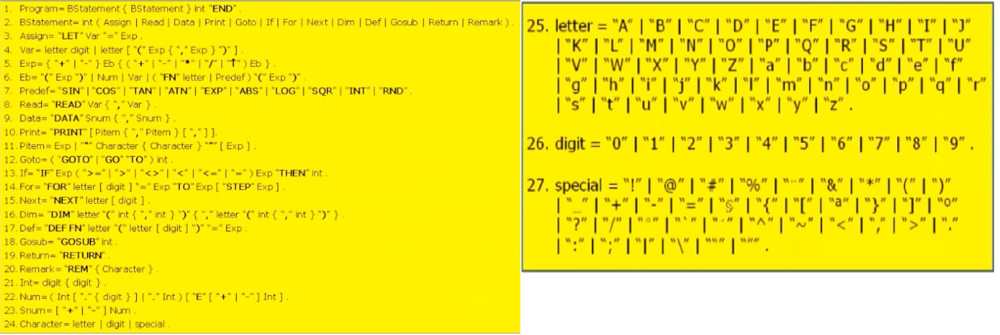

# PCS PCS3566 - Linguagens e Compiladores

## Rodrigo Perrucci Macharelli - 9348877

# Projeto: Implementação de um compilador simples de Basic

## Definindo a gramática



```
Program : BStatement BStatement* INTEGER END

BStatement : INTEGER Assign|Read|Data|Print|Goto|If|For|Next|Dim|Def|Gosub|Return|Remark

Assign : LET Var EQUAL Exp

Var : (letter digit|letter) 
    | (letter digit|letter) LPAREN Exp (COMMA Exp)* RPAREN

Exp: (PLUS|MINUS)* Eb (PLUS|MINUS|MUL|DIV Eb)*

Eb: LPAREN Exp RPAREN|Num|Var|FN letter LPAREN Exp RPAREN

Read : READ Var (COMMA Var)*

Data :

Print :

Goto :

If :

For :

Next :

Dim :

Def :

Gosub :

Return :

Remark : 
```

## Terminais

+ INTEGER
+ PLUS
+ MINUS
+ MUL
+ DIV
+ EQUAL
+ LPAREN
+ RPAREN
+ COMMA
+ LET
+ FN
+ READ
+ DATA
+ PRINT
+ GOTO
+ GO
+ TO
+ IF
+ THEN
+ FOR
+ TO
+ STEP
+ NEXT
+ DIM
+ DEF
+ GOSUB
+ RETURN
+ REM

## Versao simplificada para operacoes matematicas

```
Program : BStatement BStatement*

BStatement : INTEGER Assign

Assign : LET Var = Exp

Var : (letter digit|letter) 
    | (letter digit|letter) LPAREN Exp (COMMA Exp)* RPAREN

Exp: Term (PLUS|MINUS Term)*

Term: Eb ((MUL | DIV) Eb)*

Eb: PLUS Eb | MINUS Eb | INTEGER | LPAREN Exp RPAREN | INTEGER | Var
```